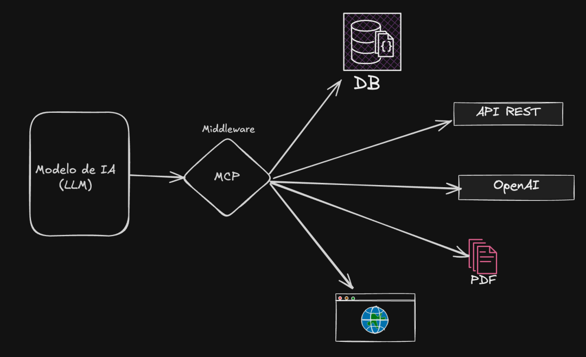

# 🧠 Servidor MCP - Extensión de Conocimiento para ChatGPT

Este proyecto muestra cómo crear un servidor **MCP (Model Context Protocol)** personalizado para extender el conocimiento de ChatGPT con fuentes de datos propias. Esta arquitectura permite conectar tus herramientas internas o externas (como pedidos, bases de datos, APIs, etc.) con ChatGPT a través de un protocolo abierto y legalmente soportado por OpenAI.

---

## 

## 🚀 ¿Qué es MCP?

MCP (Model Context Protocol) es un protocolo abierto que permite que ChatGPT se conecte a fuentes externas mediante herramientas `search` y `fetch`. Esta conexión permite enriquecer las respuestas del modelo con datos actualizados o específicos de tu empresa.

---

## 🧩 ¿Cómo funciona?

1. Se expone un endpoint `/tools/search` que permite buscar elementos por texto.
2. Se expone un endpoint `/tools/fetch` que permite obtener detalles completos por ID.
3. ChatGPT se conecta a estos endpoints mediante un **Conector de Investigación Profunda** configurado desde su interfaz.
4. Puedes conectar tu servicio a ChatGPT Enterprise, Team o Edu para que toda la organización acceda a este conocimiento.

---

## 📦 Estructura del Proyecto

Este repositorio incluye dos ejemplos funcionales:

### 1. 🔍 Búsqueda local (datos simulados)

```bash
cupcake_server.py
```

### 2. 🌐 Búsqueda externa (WordPress)

```bash
main_post.py
```

---

## 🛠️ Configuración e Instalación

### Prerrequisitos

- Python 3.8+
- Cuenta de OpenAI con acceso a ChatGPT Enterprise/Team/Edu

### Instalación

1. Clona este repositorio:
```bash
git clone https://github.com/yordansolis/mcp-server.git
cd mcp-server
```

2. Instala las dependencias:
```bash
pip install -r requirements.txt
```

3. Ejecuta el servidor:
```bash
python main.py
```

---

## 🔧 Uso

Una vez que el servidor esté corriendo, podrás conectarlo a ChatGPT mediante el Conector de Investigación Profunda usando los endpoints disponibles.

---

## 👨‍💻 **Desarrollado por Jhordan Andrés Asprilla Solís** 🌟

📧 **Contacto:** yordansolis@example.com